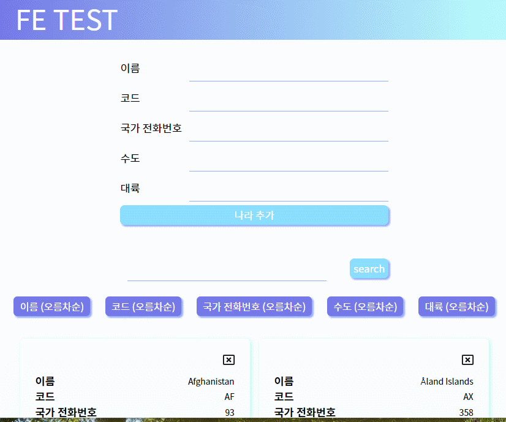

### 실행

- npm install
- npm start

### 폴더 folder

- modules: redux file 리덕스 파일
- components: presentational 컴포넌트 (UI)
- containers: container 컴포넌트 (데이터 처리)
- customHooks: 무한 스크롤 처리 함수, redux 데이터 처리 함수

### 폼 정보 form information

- AddForm: 나라 정보 추가 관련 폼
- SearchForm: 검색 폼 (lodash debounce 함수 활용)
- sortingForm: 정렬 버튼 폼

### 기능 function

#### 입력 input

!todo: 이름만 검색하게 했는데 모든 정보에서 검색하도록 바꾸기

- 입력 도중 디바운스로 검색 필터링된 정보를 보여줍니다
- 엔터를 치면 최종 검색 결과를 보여주고 입력창을 지웁니다
- 아무것도 입력하지 않고 엔터를 치면 다시 전체 데이터를 보여줍니다

#### 삭제 delete

- 필터링된 데이터에서 삭제하면 전체 데이터에서도 삭제됩니다
- 전체 데이터에서도 그대로 삭제됩니다

#### 추가 add

- 검색 필터링 된 상태에서 새로운 나라를 추가할 때 필터링 키워드에 해당하면 해당 정보를 볼 수 있습니다
- 검색 필터링 된 상태에서 새로운 나라를 추가할 때 필터링된 키워드에 해당하지 않으면 보이지 않습니다. 해당 키워드로 다시 검색하거나 전체 데이터에서 볼 수 있습니다.

#### 정렬 sort

- 국가 코드 정렬시 1 340 은 공백 삭제하고 1340으로 처리함
